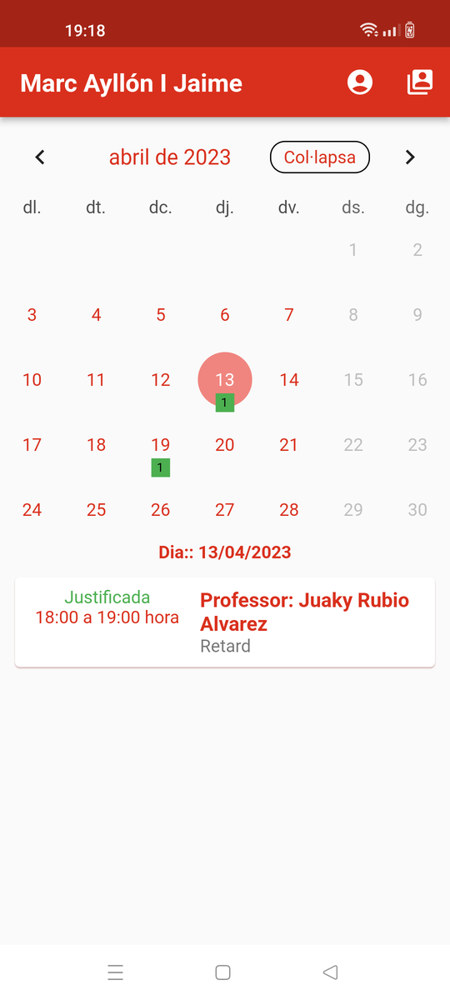

# cendrassos

Frontend de l'aplicació mòbil del Djau.

> Tot i que haria de ser possible executar-lo en Apple IOS només s'ha provat en Android.

Es pot executar en Windows i Linux però el procés d'escannejar QR no està
preparat. En aquestes plataformes s'han de fer servir usuari i contrasenya

## Característiques

El funcionament de l'aplicació es basa en la creació d'usuaris per cada
dispositiu que es connecta.

Permet:

- Mostra les notificacions en un calendari
- Es poden verificar les dades dels tutors
- Permet configurar diversos alumnes
- Emet avisos en detectar noves incidències

[Més informació](documentacio/tutorial.md)

## Configuració

Es poden canviar múltiples aspectes de la configuració editant les constants definides 
a `djau_theme.dart` i `config_djau.dart` (Es diuen Cendrassos però canviant els valors 
de la configuració es poden adaptar a qualsevol altre centre)

[Més infomació](documentacio/configuracio.md)

## Compilar i executar

Qualsevol canvi en la configuració o en el codi requereix recompilar de nou el programa. 
Per fer-ho cal el Flutter SDK.

Mentre s'executa el programa Flutter fa "live preview" en els canvis que es vagi fent
des d'Android Studio o Visual Studio Code.

[Informació](documentacio/desenvolupament.md)
