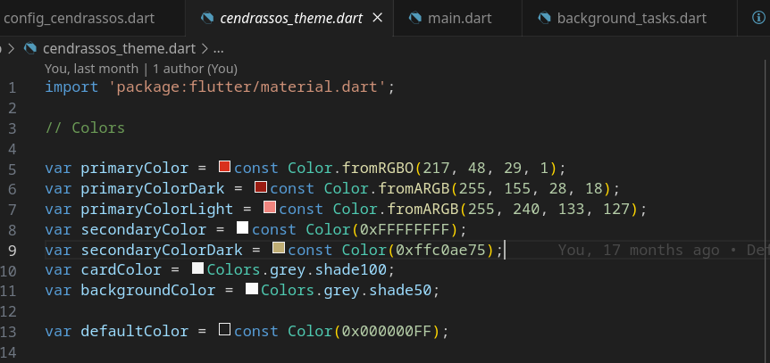

# Configurar

La configuració bàsica es troba a `config_djau.dart`

El més bàsic és definir el nom del centre, la Url d'accés, els mesos d'inici i final del curs, cada quan es comprovarà si hi ha notificacions noves, i els colors de cada tipus de notificació

```dart
const String appName = "Cendrassos";
const String nomInstitut = "Institut Cendrassos";
const String baseUrl = "https://djauproves.cendrassos.net";
const int mesIniciCurs = 9;
const int mesFinalCurs = 6;
// Cada quants minuts comprova notificacions
const int intervalNotificacions = 15;
Map<String, Color> notificacionsColor = {
  "Falta": const Color(0xFF00BCD4),
  "Retard": const Color.fromARGB(255, 197, 196, 123),
  "Justificada": const Color(0xFF4CAF50),
  "Incidència": const Color(0xFFFF9800),
  "Expulsió": const Color(0xFFF44336),
  "Observació": const Color.fromARGB(255, 197, 116, 190),
};
```

## Personalització de l'aspecte

Això comprèn dues csoes diferents:

- Canviar els logotips
- Canviar els colors

### Canviar logotips

En la carpeta assets hi ha imatges (logotip, etc..). Sobreescrivint-los amb
arxius amb el mateix nom es poden canviar sense problemes

### Canviar els colors

Els colors de l'aplicació es poden definir en el fitxer `djau_theme.dart`.
Per ara té els colors que fa servir la web i el logotip de l'institut Cendrassos.

Per canviar-los només cal canviar les constants pels colors que es vulguin
(he definit diferents formes de definir colors)

```dart
var primaryColor = const Color.fromRGBO(217, 48, 29, 1);
var primaryColorDark = const Color.fromARGB(255, 155, 28, 18);
var primaryColorLight = const Color.fromARGB(255, 240, 133, 127);
var secondaryColor = const Color(0xFFFFFFFF);
var secondaryColorDark = const Color(0xffc0ae75);
var cardColor = Colors.grey.shade100;
var backgroundColor = Colors.grey.shade50;

var defaultColor = const Color(0x000000FF);
```

En general en els IDE sol ser més fàcil perquè s'hi poden previsualitzar els colors



També es poden canviar mides de textos, etc... Però això requerirà que proveu
si tot surt correctament.
