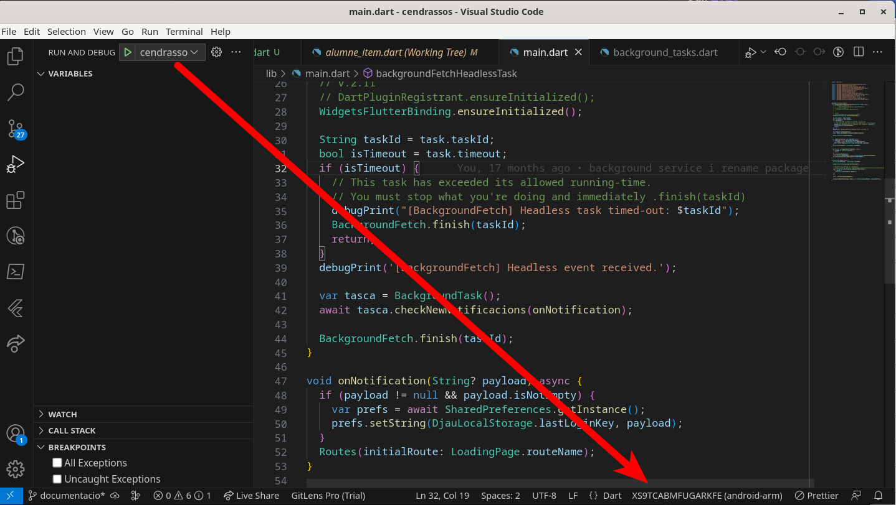

# Compilar i executar l'aplicació

Per executar l'aplicació:

Clonar el repositori

```console
git clone git@github.com:utrescu/cendrassosapp.git
cd cendrassosapp
```

Descarregar dependències

```console
flutter pub get
```

## Execució en debug

Determinar a quin dispositiu es vol executar

```console
$ flutter devices
3 connected devices:

DN2103 (mobile) • XS9TCABMFUGARKFE • android-arm64  • Android 13 (API 33)
Linux (desktop) • linux            • linux-x64      • Fedora Linux 38 (Workstation Edition) 6.3.12-200.fc38.x86_64
Chrome (web)    • chrome           • web-javascript • Google Chrome 114.0.5735.198
```

I executar-lo en el dispositiu a partir del seu Id (segona columna)

```console
flutter run -d linux
```

Si tenim un dispositiu Android connectat és bàsicament el mateix

```console
flutter run -d XS9TCABMFUGARKFE
```

En general aquest procés sol ser més senzill des d'Android Studio (amb el
plugin de Flutter) o des de Visual Studio Code (amb el plugin de Flutter)



## Aplicació mòbil

### Apple IOS

En teoria s'hauria de poder generar l'aplicació en dispositius Apple però com
que no en tinc cap, no ho he provat.

### Generar un bundle d'Android

[Android] (https://docs.flutter.dev/deployment/android)
