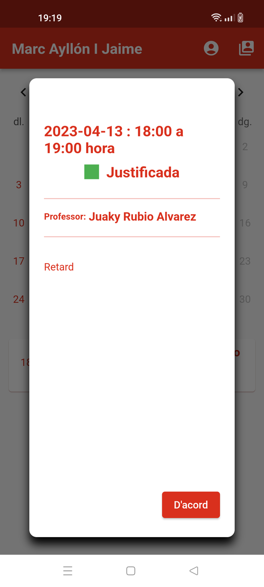
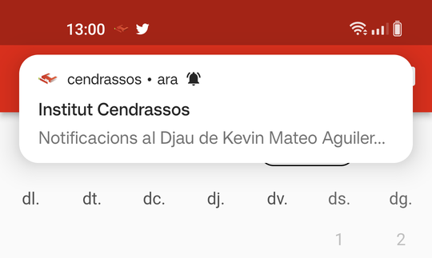

# Funcions de l'aplicació

## Afegir alumnes

Per incorporar un alumne nou a l'aplicació cal haver obtingut el codi QR que
proporcionarà el tutor.

La primera vegada que s'obre l'aplicació o si no hi ha cap alumne configurat, es dirigeix a la la pantalla d'obtenir credencials:

Amb el codi Qr i la data de naixement de l'alumne s'obtenen les credencials
d'accés al Djau.

## Llista d'alumnes

Si tot va bé l'alumne es veurà en la llista d'alumnes de l'aplicació

Les credencials no són vàlides fins que el tutor les hagi validat. O sigui
que la primera vegada encara no podrà veure les notificacions

Aquesta pantalla serveix per canviar d'alumne. Sempre està accessible en
el menú superior

Amb el botó del signe "+" es poden afegir més alumnes i es poden eliminar
desplaçant l'alumne a l'esquerra

## Veure les notificacions

Clicant sobre un dels alumnes es mostra el calendari d'un mes amb anotacions
als dies en que hi ha hagut una notificació

Les notificacions es poden ampliar, si cal, clicant-hi a sobre

## Dades familiars

La pantalla de dades familiars sempre està disponible en el menú superior:

## Avisos

El programa periòdicament comprova si hi ha notificacions en el servidor i
en cas d'haver-n'hi emet una notificació

